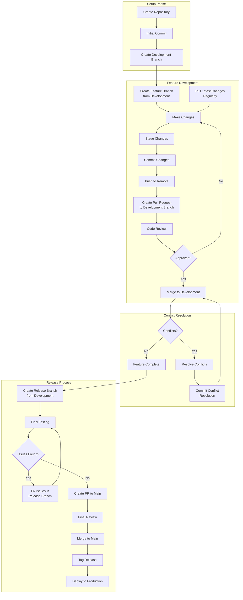

# GitHub Developer Best Practice Workflow

## Workflow Diagram

Here's the GitHub workflow diagram as a Mermaid chart:

## Visual Workflow Reference

For a more detailed visual reference, see the workflow diagram image:

## Workflow Explanation

The GitHub workflow follows these key phases:

### 1. Setup Phase
- **Create Repository**: Initialize a new GitHub repository
- **Initial Commit**: Add initial codebase and essential files (.gitignore, README.md)
- **Create Development Branch**: Establish a development branch for ongoing work

### 2. Feature Development
- **Create Feature Branch**: Branch from development for each new feature/fix
- **Make Changes**: Implement code changes for the feature
- **Stage Changes**: Add modified files to staging area
- **Commit Changes**: Commit with descriptive messages
- **Push to Remote**: Push changes to the remote repository
- **Create Pull Request**: Open a PR targeting the development branch
- **Code Review**: Have team members review the changes
- **Pull Latest Changes**: Regularly synchronize with development branch

### 3. Conflict Resolution
- **Check for Conflicts**: Determine if merging causes conflicts
- **Resolve Conflicts**: Address any merge conflicts that arise
- **Commit Resolutions**: Commit the conflict resolutions

### 4. Release Process
- **Create Release Branch**: Branch from development when ready to release
- **Final Testing**: Perform comprehensive testing
- **Fix Issues**: Address any issues found during testing
- **Create PR to Main**: Open a pull request to merge into main/master
- **Final Review**: Conduct final code and functionality review
- **Merge to Main**: Merge the release branch into main/master
- **Tag Release**: Create a version tag for the release
- **Deploy**: Deploy to production environment

This workflow follows Git Flow principles with modern adaptations that emphasize continuous integration and code quality through reviews.
